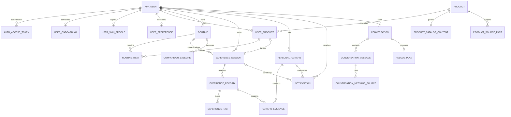

# 데이터 모델과 사전

현재 해커톤 구현은 단일 Spring Boot API와 SQLite 파일 하나를 쓴다. 실제 DDL의 원본은 [`schema.sql`](../../backend/src/main/resources/schema.sql)이고, [DBML](./schema.dbml)은 사람이 관계를 빠르게 읽기 위한 동기화된 표현이다.

Flyway는 놓지 않았다. 시연용 스키마가 자주 바뀌는 현재 단계에서는 `schema.sql`을 새 DB의 기준 스키마로 유지한다. 이미 배포된 SQLite는 `deploy/oci/migrations/*.sql`의 작은 운영 마이그레이션을 순서대로 적용하므로, `schema.sql`이 바뀌면 같은 PR에서 기존 DB의 동등한 변경도 준비한다.

## 핵심 관계



## 용어

| 테이블 | 의미 | 중요한 규칙 |
| --- | --- | --- |
| `app_user` | 아이디·비밀번호 계정 | 아이디는 대소문자 무관 유일, 비밀번호는 BCrypt hash만 저장 |
| `auth_access_token` | 로그인 상태를 유지하는 30일 단일 액세스 토큰 | 원문은 저장하지 않고 SHA-256 hash와 절대 만료 시각만 저장. 리프레시 토큰은 없으며 로그아웃·계정 삭제 시 폐기 |
| `user_onboarding` | 최초 설정의 완료 상태 | 행이 있어야 온보딩 완료로 보며 재접속 후에도 유지. 현재 8단계 프로필 흐름은 `EXPLORE`, 제품 0개로 기록 |
| `user_skin_profile` | `prototype_2` 8단계에서 직접 받은 자기보고 피부 프로필 | 연령대·성별·피부 타입·최근 상태·고민·사용감·기피·시도 빈도를 한 사용자당 한 행으로 저장하고 수정 시 통째로 갱신 |
| `user_preference` | 온보딩과 설정에서 받은 사용감 선호 (ONB-01) | `user_skin_profile`의 사용감·기피 항목을 기존 개인화 소비자와 연결하며 실제 경험보다 약한 자기보고 맥락으로 취급 |
| `product` | 검색 가능한 카탈로그 제품 식별 정보 | `description`, `facts_json`은 출처 미확인 카탈로그 입력으로 제품별 AI 가이드에만 사용. 확인 사실·추천·Rescue 근거로 승격하지 않음 |
| `brand_asset` | 카탈로그 브랜드 표시명과 저장소 로고 애셋의 연결 | `product.brand` 또는 직접 입력 브랜드와 정확히 일치할 때만 로고를 연결. 브랜드를 법적 제조사·소유 회사·OEM/ODM으로 해석하지 않음 |
| `product_catalog_content` | 모든 제품에 제공하는 제품 안내 | 제품별 설명·특징·category·등록 제형을 바탕으로 정체와 일반 사용법을 설명하며, 입력에 없는 적합성·효능·성분을 만들지 않고 생성 출처와 시각을 저장 |
| `product_source_fact` | 출처를 다시 열 수 있는 제품 사실 | 출처명·URL·확인 시각이 모두 있는 행만 API와 AI의 `출처 확인 사실`로 노출 |
| `product_achievement` | 제품과 정확히 일치하는 외부 성과 이력 | 발생 시점·부문·출처·확인 시각을 보존해 상세에만 표시하며 제품 사실·AI 추천 근거로 쓰지 않음 |
| `user_product` | 사용자가 가진 화장품 | 카탈로그 제품 또는 사용자 직접 입력 이름 중 하나는 필수 |
| `routine` | 특정 기간 실제로 사용한 조합 | 사용자별 `CURRENT` 하나, 수정은 기존 행 보존 후 새 행 생성 |
| `routine_insight` | 개인 기록·자기보고 맥락에서 AI가 정리한 루틴의 읽기 전용 도움 문장 | 루틴 버전당 한 문장이며 제품·순서와 분리 저장. 모델·프롬프트 버전·입력 record ID snapshot을 함께 추적 |
| `routine_insight_keyword` | 루틴 AI 문장과 함께 보여주는 개인 키워드 2~3개 | 표시 순서를 보존하며 같은 루틴 안에서 중복하지 않음 |
| `routine_item` | 루틴의 제품·아침/저녁·순서·빈도 | 루틴 안에서 제품은 하나이며 `BOTH`로 아침·저녁 사용을 함께 표현 |
| `experience_session` | 제품 하나 또는 루틴을 써보는 한 번의 기간 | 사용자별 `ACTIVE` 하나, 시작 7일 후가 기본 전체 확인 시점 |
| `experience_record` | 만족·아쉬움·모름, 원문, 불편 여부 | 만족도와 불편함은 별도 축, 중복 제출은 `client_request_id`로 차단 |
| `comparison_baseline` | Rescue 변경점 비교의 기준 루틴 | 7일 기록에서 불편함이 보고되지 않은 루틴을 현재 기준으로 연결 |
| `personal_pattern` | 여러 경험에서 반복된 선호·차이의 표현 | 피부 타입이나 원인 판정이 아님 |
| `pattern_evidence` | 패턴을 지지하거나 반대하는 원본 기록 | `SUPPORTS` 또는 `CONTRADICTS` |
| `notification` | 경험 회고 시점·프로필·패턴·탐색 진입을 알리는 앱 안 수신함 | 경험의 due와 알림의 읽음·미루기·완료·취소를 서로 다른 컬럼으로 저장하고 `dedupe_key`로 같은 사건의 중복 생성을 막음 |
| `conversation` | 제품·패턴·Rescue·자율 질문을 담는 공통 채팅 | 모드만 다르고 UI와 메시지 계약은 공통 |
| `conversation_message` | 사용자/AI 메시지 | AI 답변마다 동적 후속 입력 1~3개와 검증된 개인 근거 참조를 JSON으로 저장 |
| `conversation_message_source` | AI 답변이 실제로 인용한 웹 출처 | OpenAI `url_citation`의 HTTPS URL만 메시지별 순서와 P1~P4 등급으로 저장 |
| `rescue_plan` | 사용자 승인 전 루틴 제안 | 제안 기준 루틴가 현재 루틴과 같을 때만 적용 |

## 상태 전이

### 사용 경험

```text
ACTIVE
├─ 7일 전체 경험 저장 → COMPLETED
├─ 사용자가 마침 → COMPLETED
└─ 새 경험·루틴·Rescue 적용 → CANCELLED
```

경험 기간 중에 느낌을 여러 번 남겨도 `ACTIVE`를 유지한다. 7일 확인 기록을 남기면 서버가 별도 종료 버튼 없이 완료한다.

### 앱 안 알림

```text
예약됨(available_at 미래)
  → 노출 가능
      ├─ 읽음(read_at) ───────────────┐
      ├─ 미루기(snoozed_until) → 재노출│
      ├─ 행동 완료(completed_at)       │
      └─ 원본 흐름 종료(cancelled_at)  │
```

`experience_session.review_due_at`은 경험을 돌아볼 제품 상태이고, `notification.read_at`은 메시지를 확인했는지에 대한 UI 상태다. 알림을 읽거나 미뤄도 경험의 due·ACTIVE 상태는 바뀌지 않는다. 느낌을 남기면 DAY 2 확인 알림을, 7일 회고로 경험이 끝나면 해당 경험 알림을 완료 처리한다. 새 경험이나 루틴 변경으로 원본 경험이 취소되면 남은 알림도 취소한다.

### Rescue 제안

```text
PROPOSED → APPLIED
         → DECLINED
BLOCKED  (안전 경계·비교 정보 부족)
```

AI가 적용했다고 말하는 것으로는 상태가 바뀌지 않는다. `/rescue/apply`를 사용자가 누르면 서버가 기준 루틴을 다시 검사한 뒤 새 루틴·새 경험을 함께 만든다.

## 무결성과 소유권

- 모든 개인 조회는 검증된 액세스 토큰의 `user_id`를 조건으로 사용한다.
- 다른 사용자의 `user_product`, `routine`, `experience`, `pattern`, `notification`, `conversation`은 ID를 알아도 조회·적용할 수 없다.
- 외래 키는 모든 SQLite 연결에서 켜고, 사용자 삭제 시 개인 행은 cascade한다.
- 사용자별 현재 루틴, 활성 경험, 열린 비교 기준은 부분 유니크 인덱스로 하나만 허용한다.
- AI 호출은 DB 쓰기 트랜잭션 밖에서 수행하고, 메시지 입력을 먼저 저장해 실패해도 잃지 않는다.

## JSON으로 두는 것

해커톤 범위의 JSON TEXT는 아래처럼 표시용 배열과 AI 메시지 보조 데이터에만 쓴다.

- `product_catalog_content.usage_timing_json`: 사용 시점 문구 배열
- `product_catalog_content.usage_tips_json`: API의 `usageInstructions`에 대응하는 일반 사용법 배열. 기존 DB 호환을 위해 물리 컬럼명은 유지
- `product_catalog_content.observation_points_json`: API의 `highlights`에 대응하는 `title`, `detail` 제품 특징 배열. 기존 DB 호환을 위해 물리 컬럼명은 유지
- `conversation_message.suggested_replies_json`: AI 답변의 다음 추천 입력 1~3개
- `conversation_message.evidence_refs_json`: 서버 맥락에 실제로 있던 근거 ID만 저장

외부 출처는 JSON에 섞지 않고 `conversation_message_source`에 둔다. `S-1` 같은 번호는 한 AI 메시지 안에서만 유효하며, 답변 Markdown의 클릭 가능한 인라인 인용과 `source_order`가 일치한다. P1은 제품 공식정보, P2는 공공기관, P3는 연구 자료, P4는 보조 자료다. P4는 안전·효능·원인 판단 근거로 사용하지 않는다.

`product.description`, `product.facts_json`은 출처 미확인 카탈로그 입력이다. 제품별 AI 가이드가 같은 카테고리의 고정 문장으로 수렴하지 않도록 요약 입력에는 사용하지만, `product_source_fact`로 자동 복사하거나 출처 확인 badge·추천·Rescue 판단 근거로 사용하지 않는다.

## 제품 상세의 권위 순서

1. `product`는 이름·브랜드·category 같은 식별 정보를 제공한다.
2. `brand_asset`은 브랜드명이 표시되는 UI에 로고를 더하기 위한 exact-match 애셋 매핑이다. 같은 회사의 브랜드라도 자동으로 합치지 않고, 검증한 별칭만 같은 로고 URL에 명시적으로 연결한다. 로고가 없으면 API는 optional `brandLogoUrl`을 생략하며 UI는 브랜드명을 유지한 중립 문자 마크를 보여준다.
3. `product_catalog_content`는 제품별 `description`, `facts_json`, category와 등록 제형을 바탕으로 제품이 무엇인지와 일반 사용법을 설명하는 가이드다. `summary`는 상세 상단의 제품명을 반복하지 않고 제품별 특징을 먼저 설명한다. SQL fallback은 `EDITORIAL`, 생성 파이프라인 성공 결과만 `AI_GENERATED`이며 둘 다 출처 확인 사실이나 개인 적합 판정이 아니다.
4. `product_source_fact`만 출처 확인 사실이다. 근거 행이 없으면 API의 `facts`는 빈 배열이다.
5. `product_achievement`는 동일 제품에 귀속되고 성과 시점과 출처가 확인된 수상·랭킹·마일스톤 이력이다. 상세 표시용이며 `product_source_fact`나 AI 근거로 승격하지 않는다.
6. `owned`, 연결 경험 수와 원문은 사용자별 조회에서 계산하며 정적 카탈로그에 저장하지 않는다.

화장품 찾기의 동률 정렬은 `product_achievement` 행 수 내림차순을 먼저 사용하고 대표 제품·브랜드 휴리스틱을 뒤에 적용한다. 검색어가 있으면 이름·브랜드·종류의 검색 적합도가 언제나 최우선이다. 성과 수는 탐색 순서일 뿐 효능·안전·개인 적합성 점수가 아니다.

API의 `verified`는 legacy `product.verified=1`만으로 true가 되지 않는다. source-backed fact가 하나 이상 있을 때만 public projection에서 true가 되어, 기존 seed 11건에 근거 없는 확인 badge가 나타나지 않는다.

기존 DB에서는 `schema.sql` 마지막 backfill이 가이드가 없는 제품을 채운다. 생성 출처와 관계없이 과거 기록 유도형 문구가 남은 가이드는 새 제품 안내 계약의 `EDITORIAL` fallback으로 교체한다. 새 계약으로 생성된 `AI_GENERATED` 가이드와 개인 기록은 덮어쓰거나 초기화하지 않는다.

루틴 순서·경험 결과·Rescue 적용 상태 같은 핵심 상태는 JSON 안에만 두지 않는다.

## 이후 운영 배포 전에 보강할 것

1. Flyway 마이그레이션과 기존 DB 승격 검증
2. 개인 자식 행의 `user_id`를 복합 FK로 더 강하게 결박
3. AI 요청·실행·토큰·프롬프트 버전 이력 테이블
4. 패턴 재생성 및 revision 이력
5. 카탈로그 출처 snapshot과 제품 리뉴얼 버전
